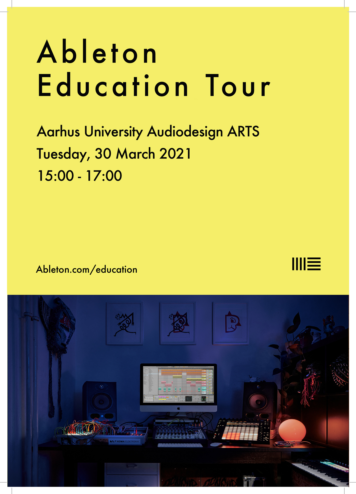

+++
title = "Ableton Education Tour"
date = "2021-03-30"
tags = ["moderator"]
image = "EDU_Tour_Poster_A4_Aarhus_University_Frederic.png"
categories = ["teaching"]
+++

Ableton and Audiodesign at Aarhus University have come together to provide participants with an introduction to new features in Ableton Live 11, and an advanced-level workshop followed by a Q&A session.
<!--more-->
This workshop is free for anyone who is interested in learning:
- how to create complex instruments
- how to work with generative tools
- how to work with advanced sound designing principles.
The showcase of Ableton Live 11 and the advanced workshop will be carried out by Ableton Certified Trainer Merlyn Perez Silva