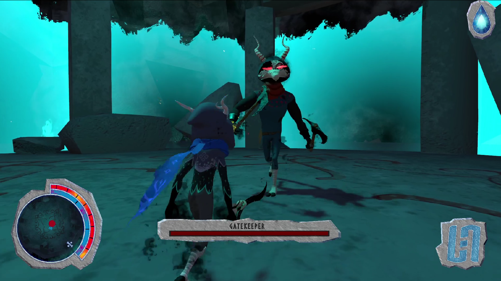

+++
image = "Ascent-notitle-cropped.png"
date = "2021-12-21"
title = "DADIU: Ascent"
tags = ["sound designer", "audio programmer"]
categories = ["game audio"]
type = "gallery"
+++


I designed and implemented sound effects using Wwise and Unity.
Graduation Game from the DADIU internship in Aalborg as part of Wizbrew Entertinment

<!--more-->
This game was created as part of an internship semester at DADIU in Denmark (The National Academy of Digital Interactive Entertainment). The game is the result of a 7 week production by a team of 19 students from different educations.

You are a Soul, a creature from a mystical kin, who spend their life awaiting the Trial of the Mountain. As you are flung out of the sky into a magical world, you know, that your time has come.

Fight your way through the Mountain's inner caves and defeat envious Maskless to overcome the trial. Arrive at the summit and defeat the Mountain's final challenge, in order to earn our right to ascension.

## Contributions
- Game & Level Designer: Khadigeh M. Abdullah
- Game & Level Designer: Razvan Andrei
- Artist: Kristoffer Birkvad
- Producer: Thea Bjerregaard
- Programmer: Stephanie Ann Christoffersen
- Game Director: No Alexander Edvars
- Programmer: Stefan Nordborg Eriksen
- QA & UR: Alexandru Orestis Giuran
- Game & Level Designer: Mathias Halilovic
- Artist: Kasper Amstrup Jensen
- Programmer: Poul Anker Jensen
- Game & Level Designer: Magnus Johansen
- Lead Programmer: Christian Bank Johnsen
- Audio Designer: Frederik la Cour
- Artist: Anja Nielsen
- QA & UR Manager: Gustav Schrøder
- Lead Artist. Portfolio.: Christian Glerup Sørensen
- Programmer: Mads Aagaard Thomsen
- Artist: Benjamin Henner Webb
- Composer: Mickie Wriedt

[Download the game here](https://dadiu.itch.io/ascent-trial-of-the-mountain)