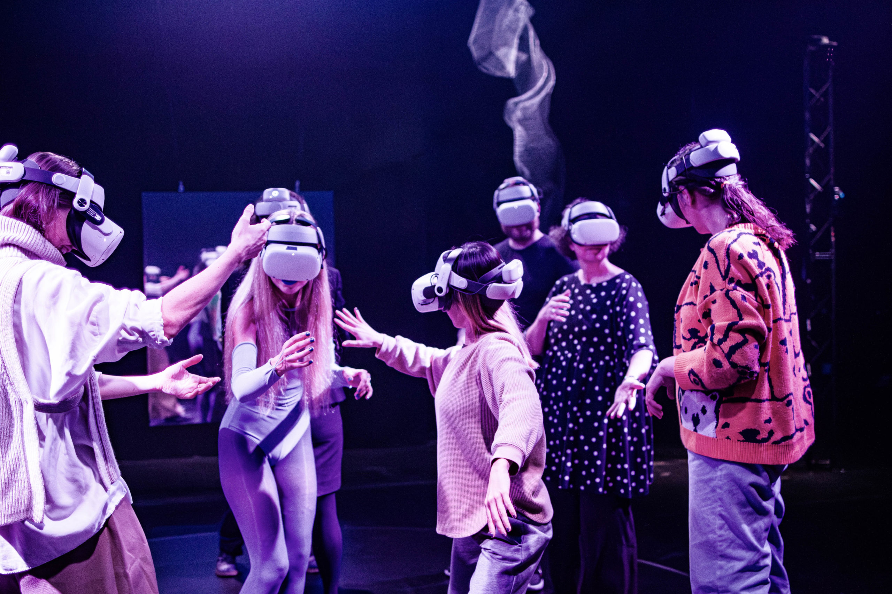
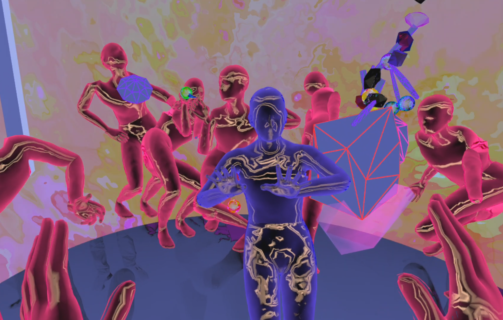

+++
image = "hybridsensation-mixedreality.png"
date = "2023-10-24"
title = "Hybrid Sensation"
tags = ["sound engineer", "VR technician"]
categories = ["vr", "mixed reality"]
type = "gallery"
+++
Immersive and multisensory experience involving interaction and physical contact with actors and participants. Multisensory interaction within the virtual and physical reality. Produced by Jakob la Cour Studio
Performed at The Royal Danish Theatre, Skuespilhuset
As part of K:SELEKT
<!--more-->

Hybrid Sensation takes place both in The Royal Danish Theatre's blackbox and in a virtual parallel world, which the audience becomes a part of as soon as they are equipped with VR headsets. During the performance, a puppet-like host, played by Iza Mortag Freund, invites the audience to interact with the shared meta-reality. Together, everyone becomes part of a mixed reality ceremony.

Hybrid Sensation is an exploration of the potential for the inclusion of various forms of augmented reality technology within the performing arts. The experience is a step on the way to comprehensive data processing and sensory-based digitization in the performing arts field.

## Contributors
- Iza Mortag Freund (Liminator)
- Jakob la Cour (Void)
- Frederik la Cour (Synchronizer)
- Artistic direction, direction and concept: Jakob la Cour
- Set designer and costume designer: Frederikke Krogh
- Composer and sound designer: Julie Østengaard
- VR artists: Matias Brunacci, Jakob la Cour
- VR technician and sound engineer: Frederik la Cour
- Kostumier: Siri Viola Nysom Sandhagen
- Production assistant: Nadia Mamchyts
- Producer, production management and PR: Anne Mai Slot Vilmann
- Dramaturgical consultation: Marie Dahl og Kirsten Dehlholm
- Caretaker: Dreeas Vilas Nicolai Asmussen
- Documentary and videographer: Jacob Hesselberg
- Video trailer: Søren Meisner
- Performance illustration and poster: Jakob la Cour

### Big thanks to 
- Amina Krohn Membar for KSelekt coordination
- Peter Bandsholm for construction
- Jørn Thostrup for lighting consultation
- Dreeas Vilas Nicolai Asmussen for technical help
- Carl Emil Carlsen for IR lights 
- Joachim Dittman for VR support 
- Cenk Güzelis for VR support

Iza Mortag Freund’s contribution includes her own choreographic adaptation of 'Liminator'.

Jakob la Cour Studio’s ‘Hybrid Sensation’ is selected for KSelekt signature performance by The Danish Arts Foundation and Udviklingsplatformen.

Made possible with support from Wonderland and The Danish Arts Foundation.

It sounds like you had a significant and multifaceted role in creating a VR mixed reality experience at the Danish Royal Theater. 

## My Role
My role required a deep understanding of creative and technical aspects of mixed reality experiences. My contributions in sound directions, technical problem-solving, and collaboration with the composer played a crucial role in bringing the project to life.

### Technical Problem-Solving:
Assisting in resolving technical issues related to OSC (Open Sound Control) communication between computers, ensuring data exchange for the experience.
Troubleshooting technical issues with VR headset settings. Enabling developer settings to extend the headset's uptime. Resolving tracking issues to ensure a seamless VR experience. Setting up infrared lights in the space to enhance tracking accuracy.

### Sound Direction and Mixing:

Collaborating with the composer to settle and direct the sounds for the mixed reality experience.
Assisting in the mixing and mastering of the sounds in a quadrophonic speaker setup.
