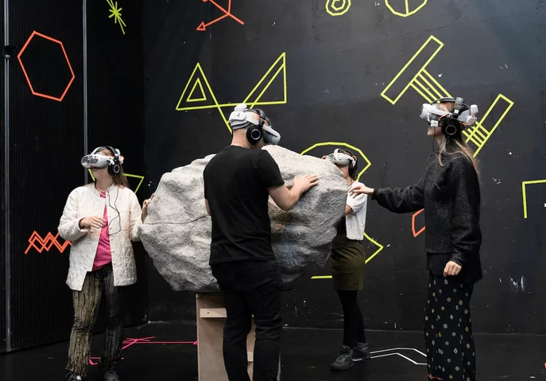

+++
image = "mortalities_therock-cropped.jpeg"
date = "2023-08-14"
title = "Mortalities"
tags = ["sound designer", "audio programmer"]
categories = ["virtual reality", "game audio"]
type = "gallery"
+++

I designed and implemented sound effects using Wwise and Unity. Worked closely together with SØS Gunver Ryberg in implementing her compositions through a combination of ambisonics and object-based audio within Wwise middleware.

<!--more-->

Four guests are let in at a time for this exclusive experience which is both physical and virtual. After an entering ritual you physically walk around in a big live installation where a multisensorial death opera is taking place.

Inspired by necroaesthetic aspects of death, the artistic team has developed six versions of death which you get to try. You travel through the cold, the heavy, the dirty, the distorted and get close to the full decomposition – before life rises from the ashes again.

Mortalities is a necroaesthetic VR opera, investigating the intersection between VR, performance and opera.
The work, besides challenging the format of opera by offering a novel virtual opera, examines the borders between life and death, and between live and digital.
Without our characteristic ability to transcend and form ideas about death, the reality is unanchored and without purpose. The theme is inspired by Mikkel Krause Frantzen’s theory on ’necroaesthetics’ presented in his text ’Ligvariationer’ (Mortalities). Necroaesthetics is not necessarily the story of an actual death, but tries to present the state where boundaries between life and death are negotiable - and with the development of technology, even more so. According to Frantzen, three components constitutes a necroaesthetic work: the affectivity of grief, a paradoxical temporality and a spectral materiality.

## six perspectives of death
Cultural researcher Jakob Matzen suggests looking at death from a range of different perspectives. He divides necroaesthetics into six categories: the spectral, grotesque, transcendental, self-destructive, post-human and architectonic necroaesthetics.

- **The spectral necroaesthetics:** the ontological understanding of death, trauma and history. It is the haunting and presence of ghost-like existences hovering between substance and phenomena.
- **The grotesque necroaesthetics:** is the psychological and sexual dynamics. It is the exceedance of boundaries and the process from dying to death. It revolves around the corpse as it represents physical and bodily death. There is an almost erotic fascination of the degenerated body - a fascination of flesh and blood.
- **The transcendental necroaesthetics:** is the metaphysical understanding of death. Our fictional imagination and the exceedance of our own experience might result in obtaining transcendence with the possibility of experiencing immortality. It is the manifestation of death in the living where boundaries between life and death are fluid.
- **The self-destructive necroaesthetics:** suicide is what distinguishes us from most animals. This category questions how self-destructive actions might tip the balance of power in society. Who has the power over one’s life and death? Suicide and self-destructivism are active actions that represents the reluctance to live and the need of self-determination.
- **The post-human necroaesthetics:** is when boundaries between technology and biology, between life and death, are negotiable. It represents the will and ability to prolong life. According to the perception of death in the Western world, we try to keep death distanced from our lives and if we can, in denial.
- **The architectonic necroaesthetics:** is the spatial manifestation of necroaesthetics on an urban level. For instance, in the form of monuments and/or objects. It is understanding necroaesthetics on a global and political level.

## Press
“...en intens oplevelse, der gør det, opera gerne vil: erobre dig hundredeprocent” <3 <3 <3 <3 <3 Politikken

## Venues 
- S/H Teater
- Aarhus Musikhus

## Contributors
Concept & Artistic Direction REBEKKA SOFIE BOHSE MEYER
Composition of Electronic Music, Choir & Voices SØS GUNVER RYBERG 
Visual Artist / Design of Environment and Characters NINNA STEEN 
Libretto URSULA ANDKJÆR OLSEN 
Animation & Choreography NINNA STEEN 
VR Development MANND 
VR Producion MARIA HERHOLDT ENGERMANN 
VR Lead Technic JEPPE JOST ETZERODT 
3D Modelling & 3D Animation QUAD STUDIO 
Audio Implementation & Sound Effects FREDERIK LA COUR 
VFX Artist BASTIAN LEONHARDT STRUBE 
Vocal Recording Engineer OLIVER MATTHEW VOLZ 
Text Consultants KATRINE JENSEN, ORIEN LONGO 
Costume WINNIE CHRISTIANSEN, MARIA IPSEN 
Mask Design & Production TRINE THULSTRUP 
Props NIELS LAU NIELSEN 
Producer LARS VIND-ANDERSEN 
Stage Managing SIGNE THORNBERG 
Communications and SoMe intern EMILIE MARIE PEDERSEN
Production Company JAKOBE PERFORMING ARTS
Co-Production SORT/HVID, COPENHAGEN OPERA FESTIVAL

Live singers ANNE-KRISTINE SKOV ANDERSEN, KATINKA MARIE FRIDA BOHSE MEYER, KIRSTEN VOSS 
Singers VR ANNE-KRISTINE SKOV ANDERSEN, KIRSTEN VOSS, STEPHEN YESETA, MATHIAS MONRAD MØLLER, MIKKEL TUXEN
Solos composed through improvisation with the singers

Thanks to MIKKEL KRAUSE FRANTZEN, JAKOB MATZEN, MIXR LAB, NIIMBLR, ARTFREQ STUDIO, PAVILLION K, JEREMY PAYNE-FRANK, TINE MEYER, SOFIE MIETKE, MIKA YUNUS BERGER SAHBAZ

Funded by STATENS KUNSTFOND, BIKUBENFONDEN, AUGUSTINUS FONDEN, WILLIAM DEMANT FONDEN, WILHELM HANSEN FONDEN, DANSK KOMPONISTFORENING, DANSK SKUESPILLERFORBUND, DANSK SOLISTFORBUN

[mortalities](https://rebekkabohsemeyer.com/mortalities)