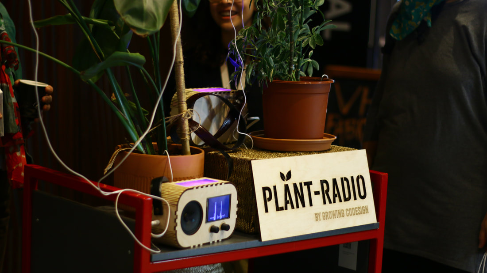
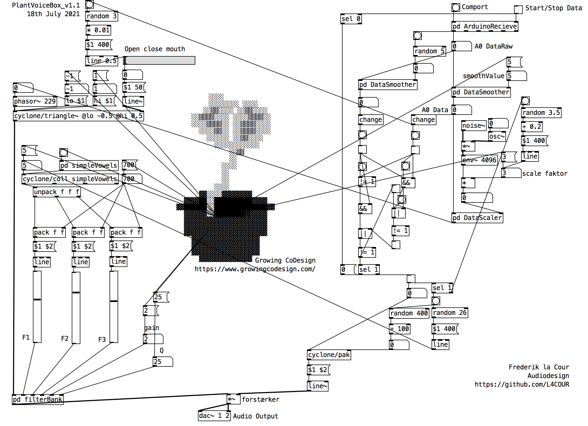

+++
image = "plant-radio-poster.jpeg"
date = "2021-07-18"
title = "Plant Radio"
tags = ["sound designer", "interaction designer"]
categories = ["physical computing"]
type = "gallery"
+++

Developing and implementing sound for the plant radio


<!--more-->

The project investigated the use of creative practice and digital technologies as a method to include nature as a partner in design practice. More specifically we harvested the electrophysiological signals emitted by plants with medical sensing technology as the base for plant-human creative-aesthetic collaborations.

## Sonification of Plants
Sonification of plants is not at all unfamiliar to me, I first encounter a eurorack module made by Instruó that would also make use of EMG technology and read the signals from the plant and convert them to CV for controlling other parameters in the synth https://www.gearnews.com/generate-cv-plants-scion-biometric-feedback-module/. I also found that Gate Wardenær worked on a projekt that was concerned with sonifying plants through Pure Data, a very interesting read https://mct-master.github.io/audio-programming/2020/02/11/plant-interface.html. However both of these projects and especially the pure data one interprets the plants signals as the classic new age blip blop sounds with a lot of reverb, sound almost more like the plant is playing or singing a piece of music. Thor Magnussons thoughts on the interrelated relationship between instrument and composition comes to mind, but is this really appropriate for a project like Growing CoDesign? I did not want to do a sonic interpretation of graph data, and I also didn’t want to make something that would sound like music or an instrument, I wanted to give the plants a voice. I thus view my approach as a critical anthropomorphic sonification.

In the pure data patch there is a heavy use af generative composition principles accompanied by machine listening. the other crucial part of this critical anthropomorphic sonification is the heavy use of formant synthesis. Formant synthesis uses DSP code to simulate the human voice and all the biological attributes that shapes the voice like mouth, tongue, nose etc. even though this form of synthesis is very human centred due to its inherently artificial and imitative nature I believe it is especially apropriate for giving plants a voice and make them a part of creative human to plant codesign processes.
[further technical details on the project can be found here](https://github.com/L4COUR/PlantVoiceBox)

## Contributors
- Artist, experimental academic: Raune Frankjær
- Associate professor in Digital Design at Aarhus University: Lone Koefoed Hansen
- Digital Designer: Margrete Lodahl Rolighed
- Developer, technical support: Marcus Due Jensen
- Student Helper: Ester Marie Aagaard
- Audio Designer: Frederik la Cour

[Growing CoDesign](https://www.growingcodesign.com/)