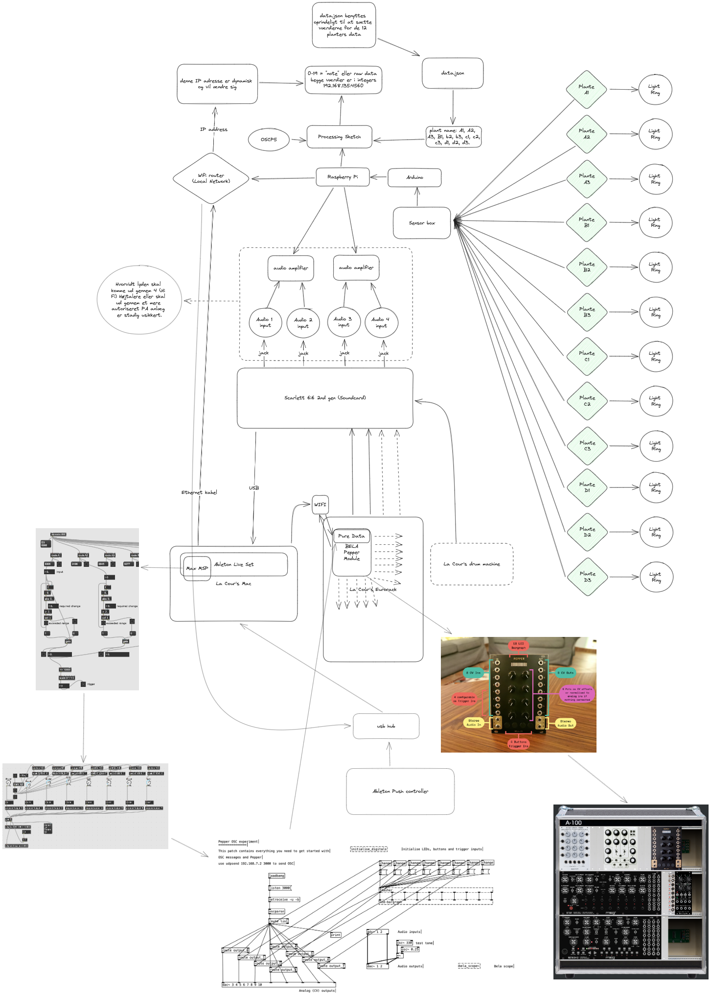
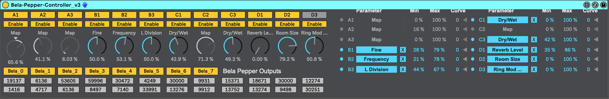
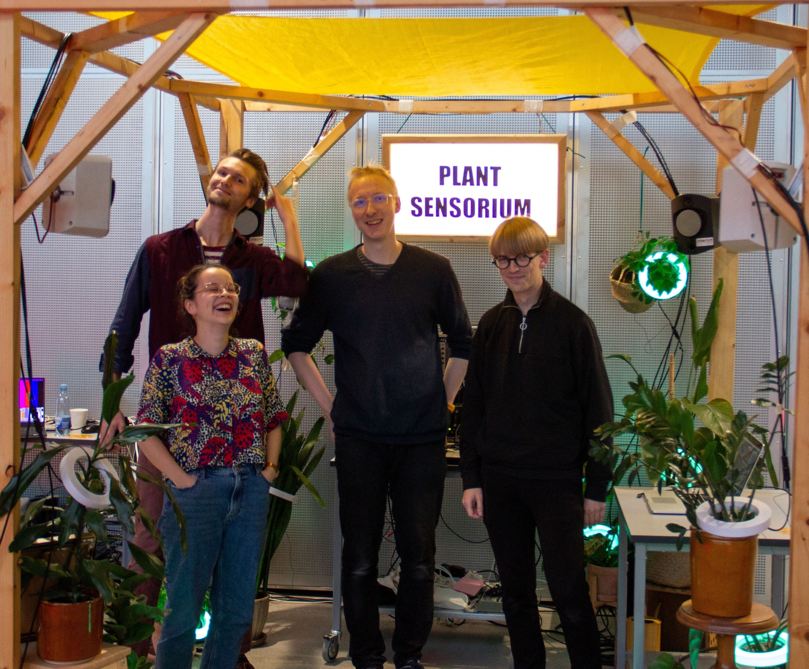

+++
image = "plantsensoriumlive_poster.jpg"
date = "2023-09-30"
title = "Plant Sensorium Live"
tags = ["sound designer", "interaction designer"]
categories = ["live performance", "physical computing"]
type = "gallery"
+++
In late august I was approached by Margrete Lodahl Rolighed and asked I was interested in performing live electronic music together with the 'Plante Sensorium' installation for the Processing Community Day 2023 at the Aarhus school of architecture.

 

<!--more-->
Margrete had been working together with Marcus Due Jensen and Martin Rossing Mørk on coupling 12 plants with capacitive sensors which enabled them to send triggers that could be interpreted through sound and light. The 'Plante Sensorium' installtion had earlier the same year debuted at Maker Faire Aarhus. However, for Processing Community Day 2023, We saw an oppertunity to transform the installation into an instrument.

## From installation to instrument

In order to achieve this transformation it was necessary to understand technical infrastructure of 'Plante Sensorium'. Each individual plant with capacitive sensor had its own address (A1, A2, A3, B1, B2, B3, C1, C2...etc) and was connected to a sensor box in which all of the sensor inputs was read by an arduino as an analog input. The arduino would parse all of the data from the plants via GPIO pins to a Raspberry Pi. A processing sketch running on the Pi would interpret the raw analog plant data and send the data via Open Sound Control (OSC) on a specified IP with a specified port. The OSC data stream was then sent out from the Pi via an ethernet cable. 

To access the data from 'Plante Sensorium' all I had to do was plug in the ethernet cable to my laptop, and create a patch with MaxMSP to recieve OSC communication. Having ensured that this minimum functionality worked I proceeded to develop a custom max for live device which I could use inside of ableton to map the data from the 12 plants to parameters of audio FX's in ableton. While this gave the plants control in the digital processing of audio I was curious to explore whether I could have the plants control parameters on my eurorack synthesizer. 

Using a DIY Bela Pepper module I was able to make a pure data patch that would allow me to send data to the module via OSC and output the plant data as control voltage (CV) which would allow the plants data to control pitch, filter, LFO, envelope, delay..etc on hardware, and make the performance more engaging.

## Contributors
- audio/interaktiondesign, production lead: Martin Rossing Mørk
- composer and sound designer: Frederik la Cour
- digital designer: Margrete Lodahl Rolighed
- user experience designer: Marcus Due Jensen

## Thanks to
- Anders Visti
- Aarhus University

 