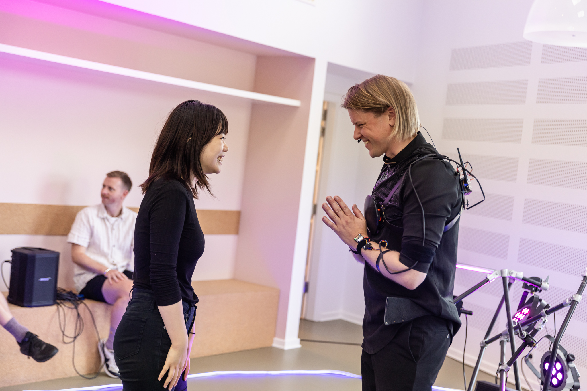
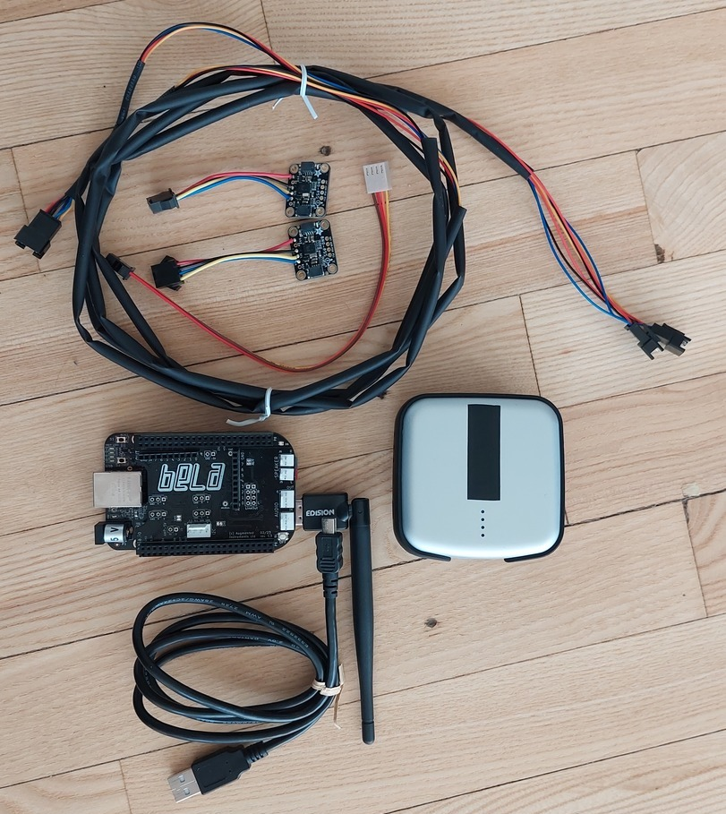
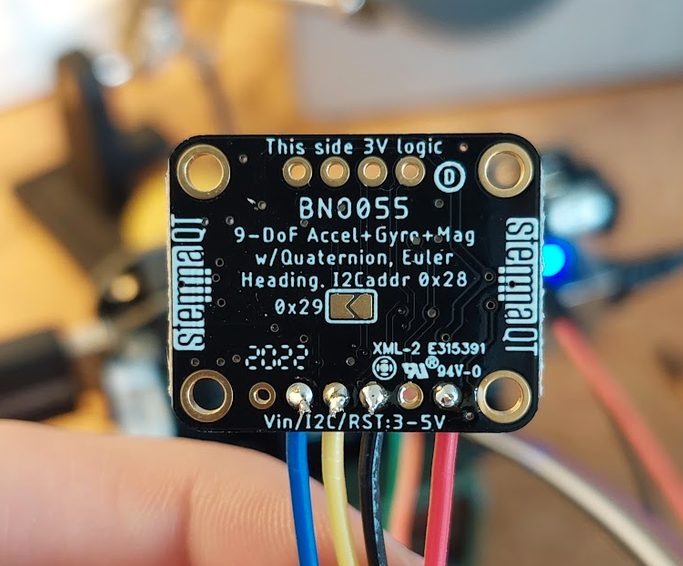
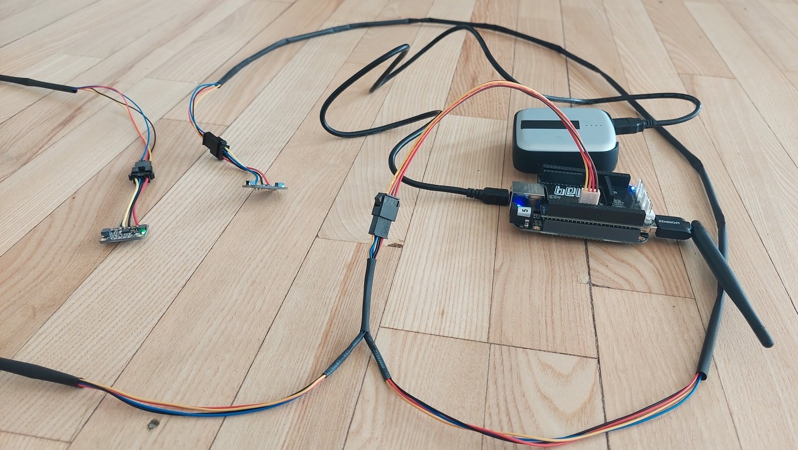
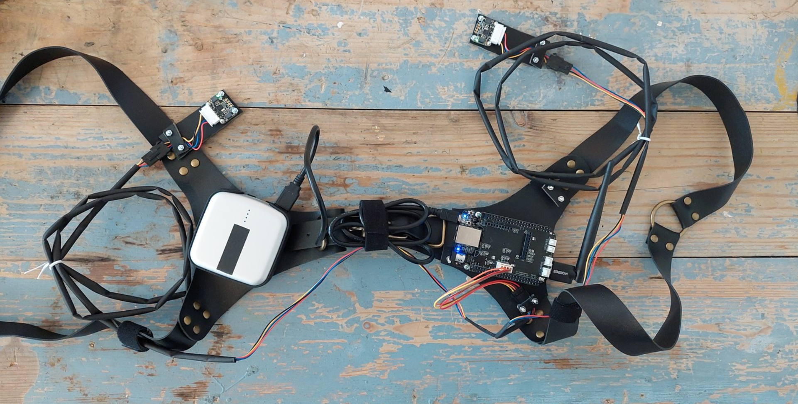
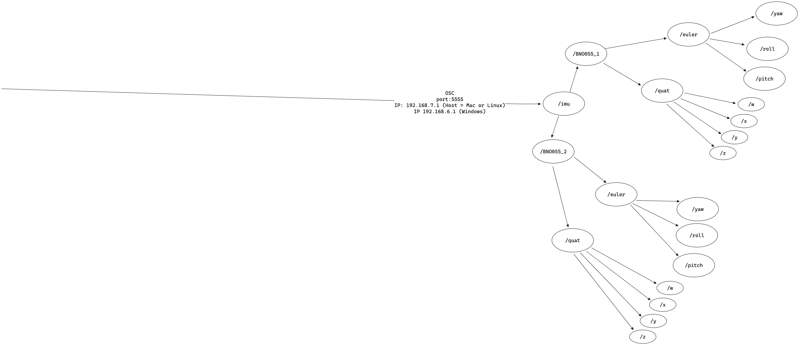
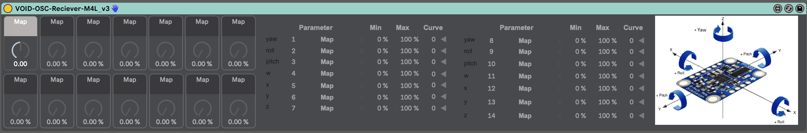
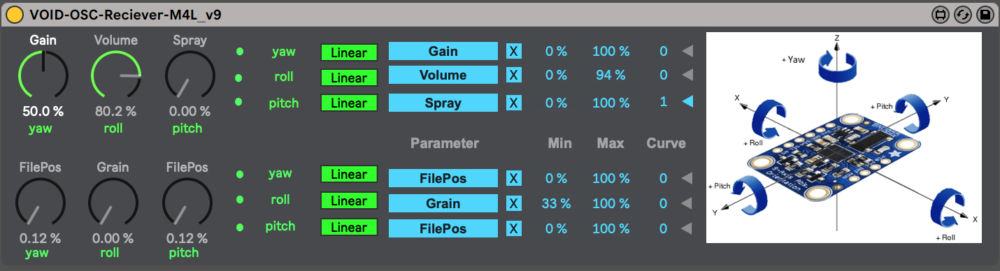
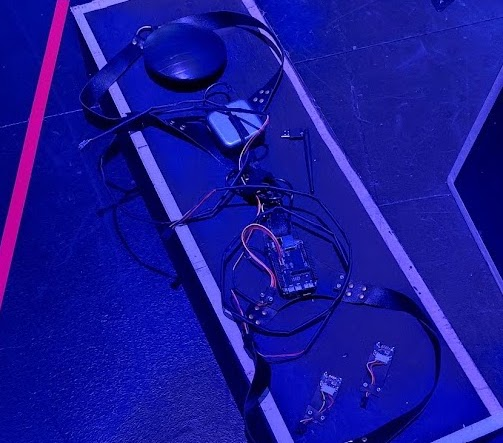

+++
image = "enchanted-amplifier-concept.png"
date = "2023-09-21"
title = "Enchanted Amplifier"
tags = ["sound designer", "interaction designer"]
categories = ["physical computing"]
type = "gallery"
+++



Using Bela and accelerometer breakboards for a wearable interface that manipulates real-time sound.
<!--more-->

Image from [ReWork Artistic Exploratory:
Research and Art Exhibition](https://kuto.dk/lobende_events/research-and-art-exhibition-rae2/) Jakob la Cour performing through the enchanted amplifier.

## Wearable designprocess

At its core the circuit consists of a Bela microcontroller board, equipped with a wifi-dongle, powered through USB by a voltaic V25 battery pack. This setup enables the circuit to run wirelessly without restricting the movement of the person wearing the device with cabled connections to a laptop.

Connected to Bela via I2C communication protocol are two BNO055 Adafruit breakout boards with 9-DOF absolute orientation sensors. By soldering the pad on the backside of the sensor on one of the BNO055 breakout boards I was able to change its I2C address from its default 0x28 to 0x29. This enabled the code running on the Bela microcontroller to distinguish between the two sensors.

In order to connect the two BNO055 sensors to the Bela board, I created a cable that would interface with the Bela board through a molex connector with 4 cables carrying (Vin, SCL, SDA and GND) and branched out to the two sensors with sturdy JST-SM connectors.

To make the circuit wearable, we modified a leather harness to fit the core of the circuit. Using a leather hole puncher, knots and bolts we were able to secure the Bela board to the harness.

 

The two BNO055 Breakout sensors were to be mounted securely on the users wrists. to make the sensors more sturdy these were mounted to pieces of leather with knots and bolts as well. Due to time constriants in the production we resulted to have the sensors mounted with electrical tape, which makes them wearable although not as securely mounted, resulting in less precise readings of the spatial data. The ideal solution would be to use arm bracers to house the two sensors which could be strapped with 2 or 3 straps to the arm providing as little wiggle room as possible for maximum precission of the spatial data.

## Interpreting absolute orientation data

Modifying the code from [giuliomoro's fork](https://github.com/giuliomoro/belaonurhead) of the belaonurhead project from the [Interactive spatial audio workshop - Using Bela for binaural head tracking 2017](https://blog.bela.io/headtracking-for-binaural-spatial-audio-with-bela/) I was able to access both euler and quaternion spatial data from each BNO055 sensor and transmit the values wirelessly using Open Sound Control (OSC). With both euler (yaw, pitch, roll) and quaternion (w,x,y,z) data it was possible to control 7 parameters per arm. I created a max for live device for retrieving the OSC messages carrying the spatial data.

 

all 14 values from the Bela would be parsed to the max for live device and provide visual feedback to the user by moving the dials the the left hand side. The user would then be able to select "yaw" and use the movement data to map a parameter of an audio effect within ableton live.

We tested the wearable circuit in a performance demonstration during the [ReWork Artistic Exploratory:
Research and Art Exhibition](https://kuto.dk/lobende_events/research-and-art-exhibition-rae2/) which revealed how difficult it was for the performing wearing the device to fully engage with all 14 parameters through movement alone. The complexity of 14 parameters constantly altering various parameters in ableton during a performance made it difficult to control. As a consequence i removed the quaternion (w,x,y,z) data, reducing the possible parameters that could be control per arm to 3. This made the following iteration of the max for live device, the one demonstrated in the video, more easy to use. The reduction also lightened the load of osc data transmission on the wifi.

In the video the "enchanted amplifier circuit" was supposed to have been incorporated into the "Hybrid Sensation" experience at the royal danish theater which is also were the video was shot. However, due to time constraints and various technical obstructions in the "Hybrid Sensation" the "enchanted amplifier circuit" was never implemented and was cut completely from the production.

