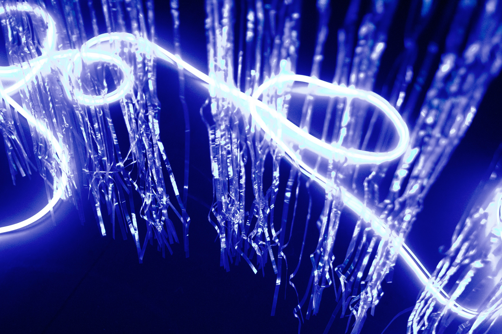
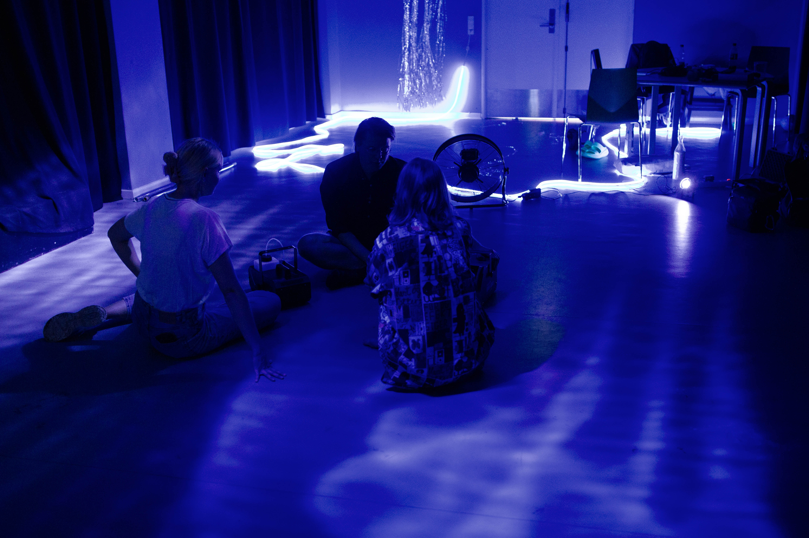

+++
image = "overflade_clean.png"
date = "2023-10-21"
title = "Overflade (Surface)"
tags = ["sound designer", "composer"]
categories = ["sound installation"]
type = "gallery"
+++

I designed and composed a 20 minut looping soundscape. Using eurorack modular patches, water splashes, and weather sounds, I wove a narrative of exploration. Electronic pulses fueled curiosity, while ethereal textures and climate sounds added magic. The U-boat phase featured sonar pings and water splashes for intrigue. Balancing ambient and unfocused elements, the soundscape flowed seamlessly, inviting the audience into an immersive, playful exploration of sonic textures. 

<!--more-->
## excerpt of soundscape


A 6 hour performance installation that invites children aged 2-6 years accompanied by an adult into an interactive and playful space. Produced by Dansehallerne, Performed at Valby Kulturhus
As part of KORAL dance festival, K:Select

With careful steps, you and your adult enter a dynamic space between above and below. Soon you become curious about the reflective surfaces, and now see that luminous prismatic colors are unleashed in the room, undulating and gentle sounds are manifested, while shadows fleetingly change shape. A Surface Being shows you fun ways to unlock secret options and moves. In this world of continuous transformation, you explore textures, surfaces and movement as you let the pulsating beauty and wonder of the water and air sweep you through your sensory explorations and increasing playfulness. 

## Contributors
- Concept and staging: Simone Wierød and Jakob la Cour 
- Choreography: Simone Wierød 
- Interaction: Jakob la Cour 
- Performer: My Nilsson 
- Sound design: Frederik la Cour 
- Costume design: Marie Nørgaard Nielsen 
- Production: Jakob la Cour Studio and Wired Studio Production 
- Assistant: Signe Rohardt Lund 
- Photo: Jakob la Cour 
- Producer: Dansehallerne and Anne Mai Castle Vilmann