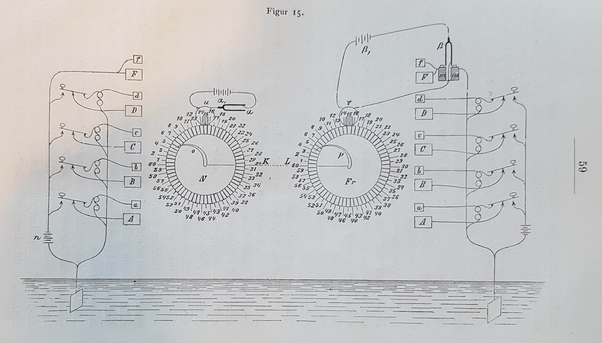
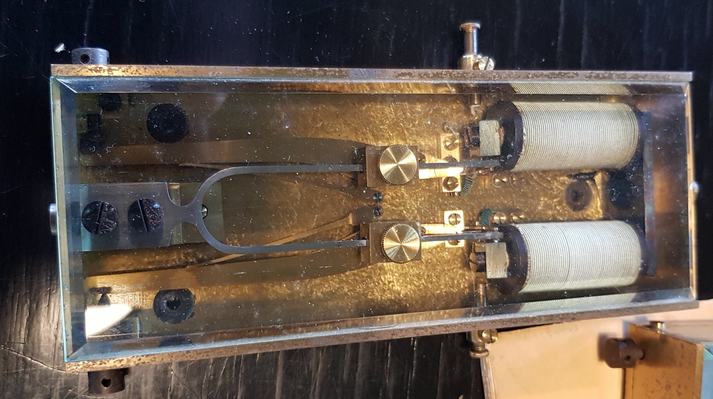

+++
title = "Audiodesign: Masters thesis"
image = ""
date = "2022-10-15"
tags = ["researcher", "sound designer"]
categories = ["research"]
+++



In my thesis I am investigating Poul la Cour’s “tonestrøms-apparat” through media archaeological methods grounded in patent drawings, reproduction and re-enactment with the aim to demonstrate “tonestrøms-apparatets” epistemological implications of our understanding of contemporary digital medias.
<!--more-->

My media archaeological approach offers a different kind of knowledge about “tonestrøms-apparatet” than what we would get through a historical chronological approach. Through my re-enactments we are able to study and form meaning based on functional operations of the circuit and materiality within “tonestrøms-apparatet” which aside from offering an understanding of contemporary digital media also reveals its potentials for future modification and alternate use cases which are able to connect operational functionalities from the past with contemporary digital technology and thereby create a short-circuit between the past and now. 

The media archaeological methods and different perspectives are all centred around my reconstruction of “tonestrøms-apparatet” which is documented from my interpretations of the patent drawing I was able to start my constructive practice and experiment with modern components and approaches diverging from the patent drawings. This further emphasises how my intention with reconstruction and re-enactment is rooted historical accuracy, but as a creative practice where history is used as a base for exploring the inherent functionality that can reveal unstable and failing circuitry which can be viewed as potentials for future modification.

Other media archaeological practices such as that of sonic archaeology utilizes electromagnetic recorder units for investigating potential electromagnetic wave emitted from the operational devices. This could be seen as a modification which expanded what kind of electrical signals could be generated from tonestrøms-apparatet. The electromagnetic signals could become a starting point for further investigation into how we could interpret or utilize these signals and further change the materiality and functionality of tonestrøms-apparatet. 

The relation between reproduction and re-enactment is further discussed through the theoretical notions of arborescent and rhizomatic structures. These abstract notions underline the connections between the concrete physical materiality and the epistemological implications through which we gain a deeper understanding for contemporary digital technologies of today.

## Acknowledgements:

- A special thanks to Morten Riis for taking an interest in my masters and helping me in establishing contact to Wolfgang Ernst. 
- Thanks to Wolfgang Ernst for his input on the Poul la Cour’s Tonehjul inventions and for showing me around Medien Archaeologisches Fundus (MAF) at Humboldt University in Berlin that was a huge inspiration. 
- Thanks to “Poul la Cour museets venner” for their interest in my project and for the opportunity to study the real “tonehjul” and “tonestrømsapparat” and allowing me access to their archive.